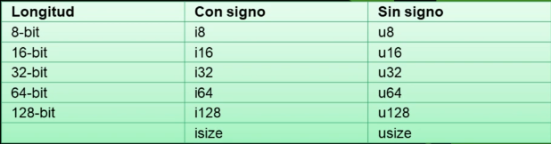

# RustProgramacion
## Variables y constantes
  Las variables se declaran con la keyword "let" y para hacer una palabra mutable se utiliza "let mut" y para hacer constantes se usa la keyword "const" y estas variables pueden ser globales o locales ahora veremos como se usarian en codigo real:
---

```rust
const PI = 3.1415;
fn main() {
    //Variables con let:
    let x = 5;
    //Ahora intentaremos cambiar la variable aunque no se use "mut" y veamos que pasa
    x = "cambiamos"; //Esto generara un error en la linea de comandos
    //Aunque realmente si se puede cambiar aplicando un concepto llamado shadowing que lo que hace es reasignar la variable y por asi decirlo destruir el anterior
    let x = "cambiamos"; // Esto no genera error
    //Variables con let mut
    let mut y = 5;
    //Ahora cambiaremos la variable 
    y = "cambiamos"; //Esto no genera error y se cambia de manera normal
    //Variables constantes
    const SALUDO = "hola";//ni lo intentes cambiar porque es una constante dara error si o si
}
```
## Nomenclatura recomendada para escribir las variables
    Variables y constantes: snake_case
        Ejemplo: mi_variable, otra_variable, constante_importante

    Funciones y métodos: snake_case
        Ejemplo: calcular_suma, guardar_archivo, procesar_datos

    Tipos y estructuras: PascalCase
        Ejemplo: MiEstructura, TipoPersonalizado, OtroTipo

    Módulos: snake_case
        Ejemplo: mi_modulo, otro_modulo, modulo_utilidades

    Crates (paquetes): snake_case
        Ejemplo: mi_crate, otro_crate, crate_utilidades

    Enumeraciones (Enums): PascalCase
        Ejemplo: EstadoCivil, OpcionesMenu, TipoError

    Variantes de Enum: snake_case
        Ejemplo: opcion_default, variante_especial, valor_otro_caso

    Tipos genéricos: CamelCase
        Ejemplo: TipoGenerico, MiTipoGenerador, OtroTipoParametrizado

    Constantes: SCREAMING_SNAKE_CASE (mayúsculas y separadas por guiones bajos)
        Ejemplo: PI, VALOR_MAXIMO, URL_BASE

# Tipos de datos
### Enteros y Flotantes

rangos:
    i8 (entero con signo de 8 bits):
        Rango: -128 a 127

    u8 (entero sin signo de 8 bits):
        Rango: 0 a 255

    i16 (entero con signo de 16 bits):
        Rango: -32,768 a 32,767

    u16 (entero sin signo de 16 bits):
        Rango: 0 a 65,535

    i32 (entero con signo de 32 bits):
        Rango: -2,147,483,648 a 2,147,483,647

    u32 (entero sin signo de 32 bits):
        Rango: 0 a 4,294,967,295

    i64 (entero con signo de 64 bits):
        Rango: -9,223,372,036,854,775,808 a 9,223,372,036,854,775,807

    u64 (entero sin signo de 64 bits):
        Rango: 0 a 18,446,744,073,709,551,615

    i128 (entero con signo de 128 bits):
        Rango: -170,141,183,460,469,231,731,687,303,715,884,105,728 a 170,141,183,460,469,231,731,687,303,715,884,105,727

    u128 (entero sin signo de 128 bits):
        Rango: 0 a 340,282,366,920,938,463,463,374,607,431,768,211,455
Para floats seria practicamente igual y aqui un pequeño ejemplo en codigo:
~~extra no se puede hacer una misma operacion usando los 2 tipos de datos numericos~~
```rust
fn main() {
    let x : f8 = 3.00;
    let y : i8 = 300;
}
```
### Boleanos
aqui se usa la keyword "bool" que solo tiene 2 valores: false y true el tamaño es de 1 bit.
Ejemplo:i
```rust
fn main() {
    let x : bool = false;
    let y : bool = true;
}
```
### De 1 solo caracter
aqui se usa la keyword "char" y debe ir en comillas simples se puede poner tanto emoojis como palabras de otros idiomas o cualquier otra cosa que requiera de 1 solo caracter.
Ejemplo:
```rust
fn main() {
    let x : char = 'c';
    let y : char = '😊';
}
```
## Tipos compuestos
### Tuplas
Se usa para agrupar varios valores de diferentes tipos con una longitud fija. Una vez creada no puede crecer ni encogerse de tamaño. 
Se escriben separados por comas y entres parentesis. Cada posicion en la tupa tiene diferentes tipos y los tipos en los 
diferentes valores de la tupla no tienen que ser iguales.
```rust
fn main() {
    let tupla: i32, f32, &str = (600, 503.00, "hola pepe")
}
```
### Arrays 

## Tipo string
Los strings se declaran con la keyword "&str"un ejemplo:
```rust
fn main() {
    let x : &str = "holamundo";
    let y : &str = "el pepe";
}
``` 
# Operadores
## Operadores aritméticos:
    + : Suma
    - : Resta
    * : Multiplicación
    / : División
    % : Módulo (resto de la división)

## Operadores de asignación:
  = : Asignación simple
  += : Suma y asignación
  -= : Resta y asignación
  *= : Multiplicación y asignación
  /= : División y asignación
  %= : Módulo y asignación

## Operadores de comparación:
  == : Igual a
  != : Diferente de
  < : Menor que
    > : Mayor que
  <= : Menor o igual que
    >= : Mayor o igual que

## Operadores lógicos:
  && : Y lógico (AND)
  || : O lógico (OR)
  ! : Negación lógica (NOT)

## Operadores de bits:
  & : AND a nivel de bits
  | : OR a nivel de bits
  ^ : XOR a nivel de bits
  << : Desplazamiento a la izquierda (shift left)
    >> : Desplazamiento a la derecha (shift right)

## Operadores de incremento y decremento:
  ++ : Incremento (no es compatible en Rust, solo se puede usar como x += 1)
  -- : Decremento (no es compatible en Rust, solo se puede usar como x -= 1)

## Otros operadores:
  . : Acceso a miembros (para acceder a miembros de una estructura o módulo)
  : : Separador de tipo (por ejemplo, en la declaración de variables con tipo)
  ::: Resolución de alcance (para acceder a constantes, funciones o tipos asociados a un módulo)